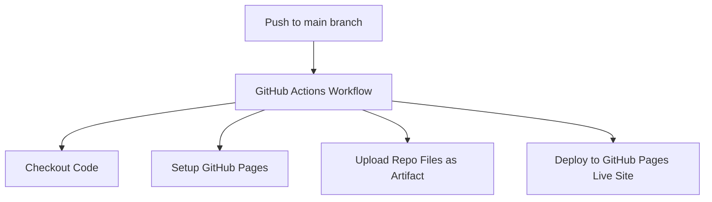

# GitHub Pages Auto-Deployment Design

This document details the design and setup for deploying the entire `tools` repository to GitHub Pages automatically whenever changes are pushed to the `main` branch.

## User Action Required

> [!IMPORTANT]
> Since we are using the native GitHub Actions deployment method (Approach 2), you must change a setting in your GitHub Repository settings after pushing the workflow file:
> 1. Go to your GitHub repository: `https://github.com/soakit/tools`
> 2. Click on **Settings** -> **Pages** (in the left sidebar).
> 3. Under **Build and deployment** -> **Source**, change the dropdown selection from "Deploy from a branch" to **GitHub Actions**.

## Proposed Changes

We will introduce a root navigation portal to link the sub-projects and a GitHub Actions workflow to run the automatic deployment.



---

### Root Portal Component

#### [NEW] [index.html](file:///d:/workspace/tools/index.html)
A modern, dark-themed, glassmorphism-style landing page placed at the repository root. It acts as a portal connecting the two main tools:
1. **Math Cube3D** (`/math-cube3d/index.html`) - 3D cube folding demonstration.
2. **Excel Tool** (`/excel-tool/index.html`) - Excel column data distribution tool.

**Key visual features:**
- HSL-tailored dark purple/deep blue gradient background.
- Clean typography using the "Outfit" Google Font.
- Responsive CSS Grid layout for cards.
- Hover-activated neon glow micro-animations.

---

### GitHub Actions Configuration

#### [NEW] [deploy.yml](file:///d:/workspace/tools/.github/workflows/deploy.yml)
The automation workflow defined under `.github/workflows/deploy.yml` will look like this:

```yaml
name: Deploy GitHub Pages

on:
  push:
    branches:
      - main
  workflow_dispatch:

permissions:
  contents: read
  pages: write
  id-token: write

concurrency:
  group: "pages"
  cancel-in-progress: false

jobs:
  deploy:
    environment:
      name: github-pages
      url: ${{ steps.deployment.outputs.page_url }}
    runs-on: ubuntu-latest
    steps:
      - name: Checkout
        uses: actions/checkout@v4

      - name: Setup Pages
        uses: actions/configure-pages@v5

      - name: Upload Artifact
        uses: actions/upload-pages-artifact@v3
        with:
          path: '.'

      - name: Deploy to GitHub Pages
        id: deployment
        uses: actions/deploy-pages@v4
```

## Verification Plan

### Automated Steps
- Ensure that the workflow syntax is valid by checking with git or running a dry run if possible (or committing and pushing).
- Verify HTML links locally to ensure clicking on either card navigates correctly to the sub-folders.

### Manual Verification
- After push, check GitHub Actions tab to ensure the workflow runs and completes successfully.
- Verify the deployed URL `https://soakit.github.io/tools/` resolves and both tools function properly.
